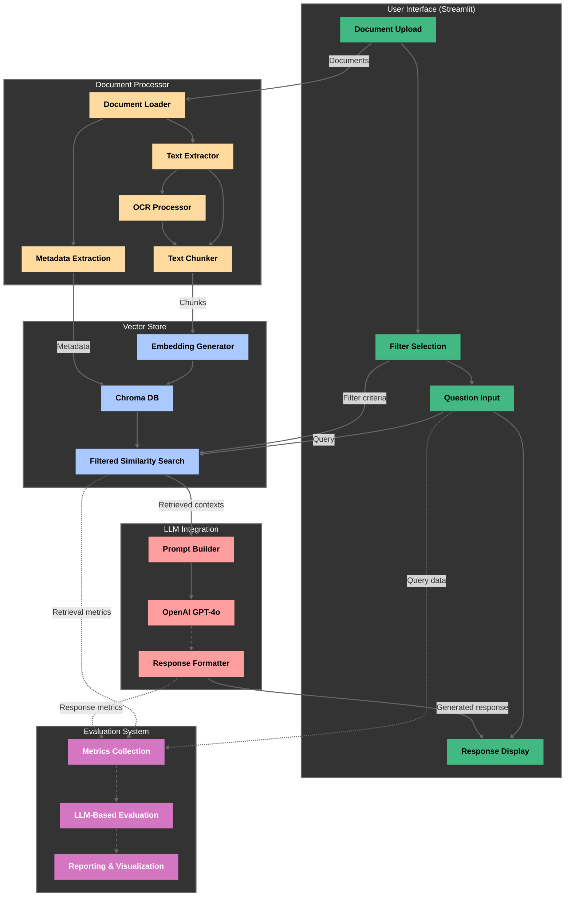

# Fortune 500 RAG Chatbot

A Retrieval-Augmented Generation (RAG) chatbot built with Python that answers user questions based on the content of multiple Fortune 500 company annual reports. The system processes various document formats (PDF, DOCX, PPTX, and images via OCR) to provide accurate and contextual responses using OpenAI's GPT-4o.

## Table of Contents

- [Overview](#overview)
- [System Architecture (HLD)](#system-architecture-hld)
- [Features](#features)
- [Project Structure](#project-structure)
- [Setup and Installation](#setup-and-installation)
- [Usage Guide](#usage-guide)
- [Testing](#testing)
- [Evaluation System](#evaluation-system)
- [RAG Pipeline Components](#rag-pipeline-components)
- [Tech Stack and Tools](#tech-stack-and-tools)
- [Acknowledgments](#acknowledgments)

## Overview

This RAG chatbot system combines document processing, vector embeddings, and large language model capabilities to create an intelligent document-based question answering system. The chatbot:

1. Ingests and processes documents in multiple formats (PDF, DOCX, PPTX, images)
2. Extracts, chunks, and vectorizes text content
3. Stores vector embeddings with metadata in a vector database
4. Retrieves relevant content when questions are asked
5. Generates contextual, accurate responses using OpenAI's GPT-4o
6. Presents information through an intuitive Streamlit interface

The system is designed to help users quickly extract and understand information from lengthy financial reports by providing accurate, citation-backed answers to specific questions.

## System Architecture (HLD)

### High-Level Design



### Component Breakdown

1. **Document Processor**
   - Handles ingestion of PDF, DOCX, PPTX, and image files
   - Extracts text using specialized extractors for each file type
   - Implements OCR for image-based documents
   - Chunks text appropriately for vector embedding
   - Extracts and applies metadata (company, year, document type)

2. **Vector Database**
   - Generates embeddings using OpenAI's embedding model
   - Stores vector embeddings in Chroma DB
   - Manages indexing for efficient retrieval
   - Implements similarity search functionality

3. **LLM Integration**
   - Constructs effective prompts using retrieved context
   - Integrates with OpenAI GPT-4o API
   - Implements fallback strategies for ambiguous queries
   - Formats and refines LLM responses

4. **User Interface**
   - Provides document upload capabilities for multiple file types
   - Implements chat interface for question input and response display
   - Offers metadata filtering options
   - Displays processing status and progress indicators

5. **Evaluation System**
   - Measures latency for retrieval and response generation
   - Evaluates response quality using LLM-based assessment
   - Generates visualizations and detailed reports
   - Tracks system performance over time

### Data Flow

1. User uploads documents through the Streamlit interface
2. System processes and chunks documents by paragraph
3. Text chunks are converted to vector embeddings
4. Embeddings are stored in Chroma DB with metadata
5. User asks a question through the interface
6. Question is embedded and relevant chunks are retrieved
7. Retrieved context is used to construct a prompt for GPT-4o
8. LLM generates a response based on the provided context
9. Response is displayed to the user with source attributions
10. Optional: Performance metrics are collected for evaluation

## Features

- **Multi-format Document Processing**: Handles PDF, DOCX, PPTX, and images
- **OCR Integration**: Extracts text from images and scanned documents
- **Intelligent Chunking**: Splits documents into semantically meaningful chunks
- **Metadata Tagging**: Associates company name, year, and document type with chunks
- **Vector Similarity Search**: Retrieves the most relevant content for each query
- **Contextual Response Generation**: Uses GPT-4o to produce accurate, helpful answers
- **Source Attribution**: Cites the specific document sources used in responses
- **Intuitive User Interface**: Clean Streamlit interface for document upload and interaction
- **Metadata Filtering**: Allows users to filter queries by company or year
- **Comprehensive Evaluation System**: Built-in tools to measure accuracy, completeness, and latency
- **Error Handling**: Gracefully handles edge cases (empty docs, missing input, etc.)
- **Financial Data Formatting**: Specialized handling of financial notation and figures

## Project Structure

```
fortune500-rag/
├── docs/
│   ├── images/
│   │   └── architecture_diagram.png
│   └── hld.md
├── evaluation/
│   ├── results/
│   │   ├── visualizations/
│   │   ├── [evaluation result files]
│   ├── __init__.py
│   ├── evaluator.py
│   ├── metrics.py
│   ├── run_evaluation.py
│   └── test_data.py
├── src/
│   ├── document_processor/
│   │   ├── __init__.py
│   │   ├── chunker.py
│   │   ├── loader.py
│   │   ├── ocr.py
│   │   └── text_extractor.py
│   ├── llm/
│   │   ├── __init__.py
│   │   ├── prompt_templates.py
│   │   └── response_generator.py
│   ├── ui/
│   │   ├── __init__.py
│   │   └── app.py
│   ├── utils/
│   │   ├── __init__.py
│   │   └── helpers.py
│   ├── vector_store/
│   │   ├── __init__.py
│   │   ├── embeddings.py
│   │   └── store.py
│   ├── __init__.py
│   └── config.py
├── tests/
│   ├── __init__.py
│   ├── test_document_processor.py
│   ├── test_llm.py
│   └── test_vector_store.py
├── uploads/           # Document storage directory
├── chroma_db/         # Vector database storage
├── .env.example
├── .gitignore
├── main.py            # Main entry point
├── README.md
└── requirements.txt
```

The project follows a modular structure with clear separation of concerns:
- `src/` contains the core application code organized by component
- `tests/` includes unit tests for each major component
- `evaluation/` houses the evaluation system and results
- `docs/` contains additional documentation
- `uploads/` and `chroma_db/` are data directories created at runtime

## Setup and Installation

### Prerequisites

- Python 3.9+
- OpenAI API key
- Tesseract OCR (for image processing)

### Installation Steps

1. Clone the repository:
   ```bash
   git clone https://github.com/yourusername/fortune500-rag.git
   cd fortune500-rag
   ```

2. Create and activate a virtual environment:
   ```bash
   python -m venv venv
   source venv/bin/activate  # On Windows: venv\Scripts\activate
   ```

3. Install required dependencies:
   ```bash
   pip install -r requirements.txt
   ```

4. Install Tesseract OCR (for image processing):
   - **macOS**: `brew install tesseract`
   - **Windows**: Download and install from [GitHub](https://github.com/UB-Mannheim/tesseract/wiki)
   - **Ubuntu/Debian**: `sudo apt-get install tesseract-ocr`

5. Create a `.env` file with your OpenAI API key:
   ```
   OPENAI_API_KEY=your_openai_api_key_here
   ```

## Usage Guide

### Starting the Application

You can start the application using:

```bash
python main.py
```

The application will be available at `http://localhost:8501`.

### Uploading Documents

1. Use the file upload section in the sidebar to add documents (PDF, DOCX, PPTX, or images)
2. Drag and drop files or click "Browse files" to select from your file system
3. The system will process the documents and display progress in the sidebar
4. Once processed, documents will be available for querying
5. Uploaded documents are listed in the sidebar for reference

### Asking Questions

1. Type your question in the chat input field at the bottom of the main panel
2. Press Enter or click the send button to submit your question
3. The system will:
   - Search for relevant information in your documents
   - Generate a response based on the retrieved content
   - Display the answer with proper formatting for financial data
   - Include citations to the source documents

### Example Queries

- "What was Amazon's total revenue in 2023?"
- "How did Amazon's North America segment perform in 2023?"
- "What was Amazon's operating income in 2023?"
- "How did AWS perform in 2023?"
- "How did the International segment perform in 2023?"
- "What is Amazon's strategy for AWS going forward?"

## Testing

The project includes comprehensive unit tests to ensure code quality and functionality. Tests are organized by component and use pytest as the testing framework.

### Running Tests

To run all tests:
```bash
pytest
```

To run tests with verbose output:
```bash
pytest -v
```

To run tests for a specific component:
```bash
pytest tests/test_document_processor.py
pytest tests/test_vector_store.py
pytest tests/test_llm.py
```

### Test Coverage

The tests cover:
- Document processing (file validation, text extraction, chunking)
- Vector store operations (embedding generation, storage, retrieval)
- LLM integration (prompt construction, response generation)

Each test file contains multiple test cases that verify both expected functionality and error handling.

## Evaluation System

The evaluation system measures the performance, accuracy, and completeness of the RAG chatbot. It provides quantitative metrics and visualizations to assess the quality of responses.

### Evaluation Metrics

The system measures:

1. **Latency**: Time taken for:
   - Document retrieval from the vector database
   - Response generation by the LLM

2. **Fact Coverage**: Percentage of expected facts included in the generated response

3. **LLM-Based Evaluation**: Using GPT-4o to assess:
   - Factual Accuracy (0-10): Correctness of information
   - Completeness (0-10): Coverage of key information
   - Relevance (0-10): How directly the answer addresses the question
   - Overall Score (0-10): Composite quality score

### Running Evaluations

To run a basic evaluation:
```bash
python evaluation/run_evaluation.py
```

To generate a detailed report:
```bash
python evaluation/run_evaluation.py --report
```

To evaluate a specific question:
```bash
python evaluation/run_evaluation.py --single-question 0 --report
```

### Understanding Results

Evaluation results are saved in the `evaluation/results/` directory as:
- JSON files with detailed metrics for each question
- Markdown reports with comprehensive analysis
- Visualization images showing performance metrics

The system is designed to help identify strengths and areas for improvement in the RAG pipeline, allowing for continuous refinement of the chatbot's performance.

## RAG Pipeline Components

### Document Processor

The document processor handles multiple file formats using specialized libraries:

- **PDF**: Uses pypdf for text extraction, with fallback to OCR for scanned documents
- **DOCX**: Uses python-docx for structured document parsing, preserving paragraph and table structure
- **PPTX**: Uses python-pptx for presentation content extraction
- **Images**: Uses Tesseract OCR via pytesseract with preprocessing for optimal text recognition

Text chunking strategies:
- Primary approach: Paragraph-based chunking with overlap
- Fallback approaches: Sentence-level chunking or character-level chunking when needed
- Configurable chunk size and overlap via environment variables

### Vector Store

The vector database implementation:

- **Embedding Model**: OpenAI's text-embedding-3-small for efficient, high-quality embeddings
- **Vector Database**: Chroma DB for persistent storage and efficient retrieval
- **Similarity Metric**: Cosine similarity for semantic matching
- **Retrieval Strategy**: Returns top k most relevant chunks, with configurable k parameter
- **Metadata Filtering**: Support for filtering by company, year, and document type

### LLM Integration

LLM implementation details:

- **Model**: OpenAI GPT-4o for high-quality, contextual responses
- **Prompt Engineering**: Carefully designed prompts with:
  - System-level instructions for response format and style
  - Persona definition as a financial analyst
  - Retrieved context with source attribution
  - Query with any special instructions
- **Context Management**: Optimized for GPT-4o's context window
- **Financial Data Formatting**: Special handling for consistent financial notation

### User Interface

The Streamlit UI provides:

- **Sidebar**: For document management and upload
- **Main Panel**: For chat history and question answering
- **File Upload**: Drag-and-drop or browser-based file selection
- **Chat Interface**: Natural conversational interface for questions
- **Processing Indicators**: Status messages and progress information
- **Error Handling**: User-friendly error messages

## Tech Stack and Tools

### Language and Framework Choices

- **Python**: Chosen for its rich ecosystem of libraries for NLP and document processing
- **LangChain**: Provides effective abstractions for RAG pipeline components
- **Streamlit**: Enables rapid UI development with Python, ideal for this application
- **Chroma DB**: Lightweight vector database with good performance and no external dependencies

### Embedding and LLM Selection

- **OpenAI Embeddings**: Selected for high-quality semantic search capabilities
- **GPT-4o**: Chosen for its superior reasoning capabilities and understanding of financial data

### Document Processing Strategy

- **Chunking Strategy**: Paragraph-based chunking balances context preservation with retrieval precision
- **OCR Integration**: Adds support for scanned documents and images, enhancing versatility

### Prompt Engineering Decisions

- **Financial Focus**: Prompts designed specifically for financial document analysis
- **Source Attribution**: Explicit instructions to cite sources enhance transparency
- **Financial Notation Standardization**: Consistent formatting of monetary values

## Acknowledgments

- This project uses OpenAI's GPT-4o for text generation
- Built with LangChain for RAG pipeline orchestration
- Utilizes Chroma DB for vector storage
- Uses Streamlit for the user interface and matplotlib for visualization
- Thanks to the maintainers of pypdf, python-docx, python-pptx, and pytesseract